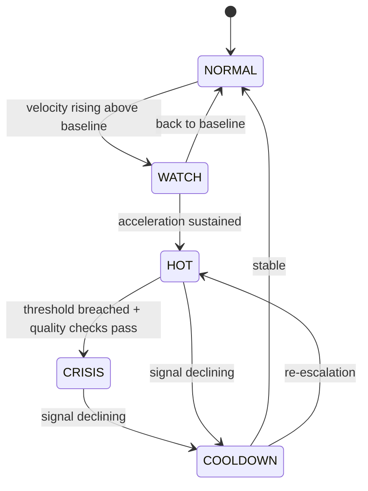

# Smart Alert — Crisis Early-Warning System

A system I designed to detect emerging crises on **social media** and **online (mainstream) media** *before* they blow up — turning a flood of raw posts and articles into a clear signal: is this normal, or is something wrong?

> Scope note: this is a concept overview. It describes the design and the metrics, not proprietary formulas, thresholds, or client data.

---

## The problem

Volume alone lies. A post can rack up likes because it's popular, not because it's a crisis. An article count can spike simply because one wire story got reposted by 40 outlets. A good alert has to tell **real acceleration** apart from **normal noise** — and do it fast, without crying wolf.

## Core idea

Instead of asking *"how many?"*, the system asks *"how fast, compared to what's normal for this moment?"*

- **Social media** is measured by **engagement velocity** — how quickly a post is gaining engagement over time, not its total.
- **Online media** is measured by **story volume** — articles are first clustered into unique *stories* (events), so 40 reposts of one wire count as **one** story, not forty.

Each is compared against a **baseline** of what's normal, and the result drives a lifecycle state.

## Key concepts

| Concept | What it is |
|---|---|
| **Snapshot** | The state of one post/story at one point in time (engagement, comments, age). |
| **Timestep** | A system tick (e.g. every 30 min); one tick can process many posts. |
| **Episode** | The full timeline of one post/story as it moves through crisis states. |
| **EVS** | *Engagement Velocity Score* — the rate of engagement change, the core social-media signal. |
| **Baseline** | The "normal" velocity for that day-of-week and hour — because normal at 3am ≠ normal at 8pm. |

## The metrics (conceptual)

- **Engagement Velocity (EVS):** change in engagement ÷ change in time. A crisis looks like a *steep, sustained climb*, not a big-but-flat number.
- **Baseline (velocity, not total):** since EVS is a velocity, the baseline is too — the *expected engagement-per-minute* for a given day/hour, learned only from **normal** history (crisis periods are excluded so the baseline stays "normal").
- **Story volume (online media):** count of **unique stories**, not raw articles — the guard against repost/syndication false spikes.

## Lifecycle (state machine)

Higher states poll **more often** (micro-fetch) so the system reacts faster exactly when it matters.

## False-alarm controls

- **Story clustering** so reposts don't fake a spike.
- **Velocity baselines by day/hour** so predictable daily rhythms aren't mistaken for crises.
- **Quality gate** before CRISIS: source diversity, tier-1 outlet presence, and repost-dominance checks — volume triggers the look, but evidence confirms it.

## What I owned

The **full concept and design**: definitions, the metrics (EVS, story-based volume, baselines), the state machine and transitions, and the false-alarm logic — handed to the engineering team as an implementation-ready spec.
